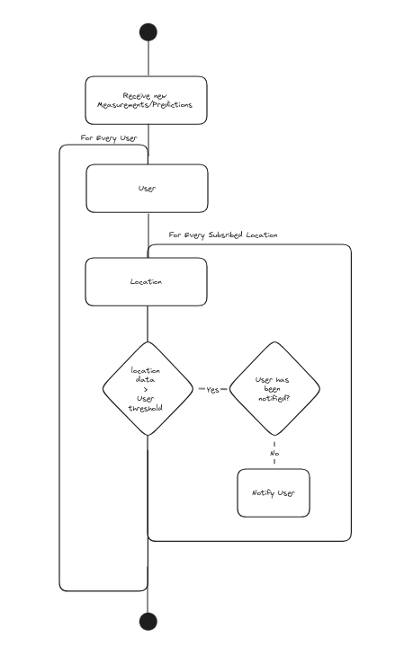

# Integration 5
This is a separate documentation repo containing, as the name suggests only
documentation. Further subgroups and repos in this project are sturctured after
our bounded contextes.

## Architecture
The basic architecture of our system is very similar to the one presented during
the first itegration lesson. The only difference is that the etl process is 
its own bounded context instead of just beeing a description of a data movement.

Check out our design [here](https://excalidraw.com/#room=6adba8b81b8ecf7e8a90,Usx2IX3r0e3MBWWh5zpQbg).

Every single encirclement in this image reppresents a separate repository but not
necessarily bounded context since frontends also have their own circles/repos but
are not their own bounded context.

All of that said we can distinguish 4 different bounded contexts:
 - extractor (bottom left)
 - data importer (top left)
 - prediction context (top right)
 - business app (bottom right)

#### Extractor
The extractor takes data from a specified number of apis packages the responses
in some metadata and throws them on a queue. More details can be found [here](https://excalidraw.com/#room=205a5378400fb3c5ee82,I7lahtjAWl7BxKv8VF45cA), 
or in this picture. 

##### Frontend
The configurator frontend allows for adding of new apis, configuration of
current apis like, activation/deactivation, interval, request parameters.
- Wireframes can be found in the [respective project](https://gitlab.com/kdg-ti/integration-5/2023-2024/team-5/extractor/extractor-frontend).

#### Data Importer
The data that is loaded onto the queue is then unloaded by the Data importer and
directly stored in a NoSQL database. This is mostly done to separate consumer
and producer of data.

#### Prediction Context
Here two things happen: (1) For on the data in the NoSQL database is cleaned up
so that it can be used for model training. This is no nessesarly in sync with
the actual model training (2) and second we train models to create predictions
for the business app. This trained model is the placed into production every so
often.

#### Business App
Here the use can spcify notification thresholds, look at data, see predictions
and be notified of anomalies. Some of the dataflows are shown in these images:

Additionaly there is more information to be found [here](https://excalidraw.com/#room=22265c59de7101932b11,2JvV0g6bChoHA2Ih7TytaA),
and in this image: 
##### Frontend
Frontend that reflects functionality.
- Wireframes can be found in the [respective project](https://gitlab.com/kdg-ti/integration-5/2023-2024/team-5/business-app/business-app-frontend).
